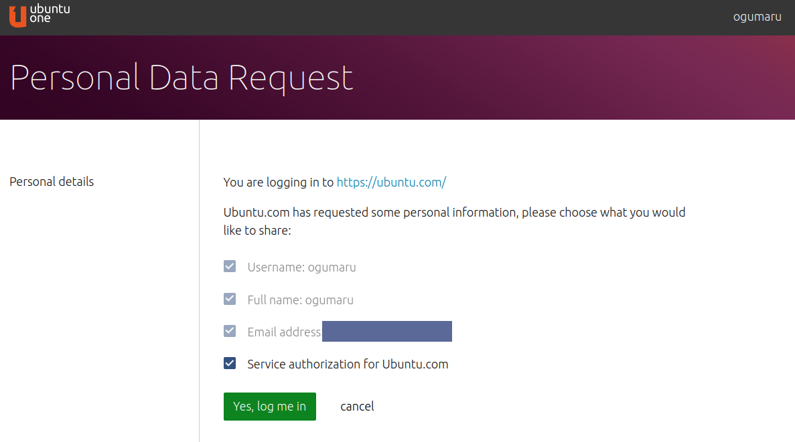
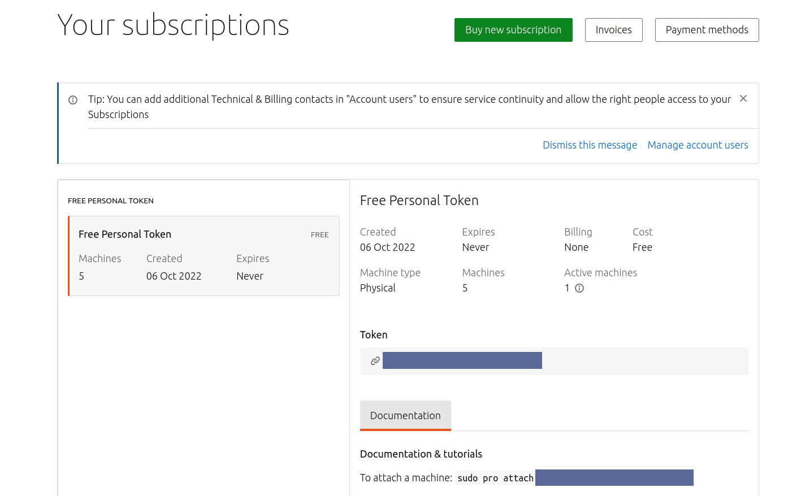
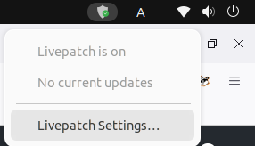
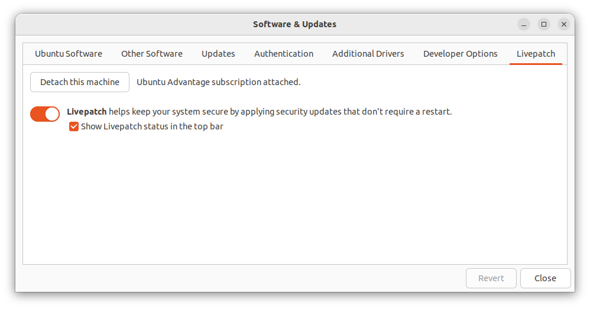

## 概要

また beta がついているが、Ubuntu Pro が[個人でも 5 台まで無償利用できるようになった](https://ubuntu.com/blog/ubuntu-pro-beta-release)ため、早速利用してみる。

全体の流れとしては以下のようになる。

1. [Ubuntu One](https://login.ubuntu.com/)のアカウントの作成
1. [Ubuntu Pro](https://ubuntu.com/pro)へログイン
1. トークンの取得
1. `pro`コマンドを利用できるようにする
1. 端末をアタッチ

[Ubuntu Pro beta tutorial](https://discourse.ubuntu.com/t/ubuntu-pro-beta-tutorial/31018)を参考に進めれば特に詰まるところもない。

## 環境

| 項目 | 内容               |
| ---- | ------------------ |
| OS   | Ubuntu 22.04.1 LTS |

## 利用手順

### Ubuntu One アカウントの作成 / Ubuntu Pro へログイン

Ubuntu One のアカウントを作成したあと、Ubuntu Pro のページから再度ログインを行うと下図の画面になる。



なお、「Service authorization for Ubuntu.com」はチェックを入れないと進めなかった。

### トークンの取得

Ubuntu Pro にログイン後、下記の画面から「UA subscriptions」を押下するとトークンが確認できる。


`Token`とある箇所にトークン、その下にはアタッチの際のコマンドが書いてある。



### `pro`コマンドを利用できるようにする

詳細は後述するが、`pro`コマンドのために追加でインストールが必要にはならなかった。

```bash
sudo apt update && sudo apt upgrade
```

### 端末のアタッチ

```bash
sudo pro attach "${表示されているTOKEN}"
# > Enabling default service esm-infra
# > Updating package lists
# > Ubuntu Pro: ESM Infra enabled
# > Enabling default service livepatch
# > Installing canonical-livepatch snap
# > Canonical livepatch enabled.
# > Unable to determine current instance-id
# > This machine is now attached to 'Ubuntu Pro - free personal subscription'
# >
# > SERVICE          ENTITLED  STATUS    DESCRIPTION
# > esm-infra        yes       enabled   Expanded Security # > Maintenance for Infrastructure
# > livepatch        yes       enabled   Canonical Livepatch service
# >
# > NOTICES
# > Operation in progress: pro attach
# >
# > Enable services with: pro enable <service>
# >
# >      Account: ogumaru@example.com
# > Subscription: Ubuntu Pro - free personal subscription
```

実行もほとんど時間はかからず、特に再起動を求められることはなかった。

上記コマンドでアタッチ後にはトップバーに下図の常駐アイコンが表示されるようになる。



「Livepatch Settings」を押下するとライブパッチの設定のほか、トップバーの常駐アイコン表示切り替えや端末のデタッチもできる。



## トークンについて

`Token`は端末認証後も変わらず(=5 台とも同じトークンを利用するはず)、またトークンの更新画面も見つからなかった。

トークンが漏れてしまった場合の対策は気になる。

## `pro`コマンドの実体について

### 結論

`ubuntu-advantage`が実体となっている。

### `pro`コマンドの有無

これまでの環境では`pro`コマンドは利用できなかった。

```bash
# pro コマンドは利用できない
command -v pro

# 実行してもパッケージの候補にはでてこない
pro
# > Command 'pro' not found, did you mean:
# >   command 'gpro' from snap gpro (1.0.24)
# >   command 'ro' from deb golang-redoctober (0.0~git20161017.0.78e9720-5)
# >   command 'proj' from deb proj-bin (8.2.1-1)
# >   command 'prt' from deb prt (0.22-1)
# >   command 'pio' from deb platformio (4.3.4-2)
# >   command 'pr' from deb coreutils (8.32-4.1ubuntu1)
# >   command 'pry' from deb pry (0.13.1-2)
# > See 'snap info <snapname>' for additional versions.
```

`apt upgrade`でパッケージ更新をしたあと利用できるようになる。

パッケージとしては`ubuntu-advantage-tools`の一部なようで、これがアップデートされることで`pro`が利用できるようになるようだ。

```bash
sudo apt update && sudo apt upgrade
# > ...
# > The following packages will be upgraded:
# >   ubuntu-advantage-tools
# > 1 upgraded, 0 newly installed, 0 to remove and 0 not upgraded.
# > Need to get 163 kB of archives.
# > After this operation, 113 kB of additional disk space will be # used.
# > Do you want to continue? [Y/n] y
# > Get:1 http://jp.archive.ubuntu.com/ubuntu jammy-updates/main # amd64 ubuntu-advantage-tools amd64 27.11.2~22.04.1 [163 kB]
# > Fetched 163 kB in 0s (723 kB/s)
# > Preconfiguring packages ...
# > (Reading database ... 183922 files and directories currently installed.)
# > Preparing to unpack .../ubuntu-advantage-tools_27.11.2~22.04.1_amd64.deb ...
# > Unpacking ubuntu-advantage-tools (27.11.2~22.04.1) over (27.10.1~22.04.1) ...
# > Setting up ubuntu-advantage-tools (27.11.2~22.04.1) ...
# > Installing new version of config file /etc/ubuntu-advantage/help_data.yaml ...
# > Installing new version of config file /etc/ubuntu-advantage/uaclient.conf ...
# > Processing triggers for man-db (2.10.2-1) ...
```

### 実体の確認と関連コマンド

`pro`コマンドの実体を確認すると`ubuntu-advantage`へのシンボリックリンクになっていた。

```bash
command -v pro
# > /usr/bin/pro

file "$(command -v pro)"
# > /usr/bin/pro: symbolic link to ubuntu-advantage
```

また、[ここ](https://ubuntu.com/security/certifications/docs/fips-enablement)に記載されているような`ua`コマンドも、同様に`ubuntu-advantage`へのシンボリックリンクとなっていた。

```bash
file "$(command -v ua )"
/usr/bin/ua: symbolic link to ubuntu-advantage
```

[Ubuntu Pro Client](https://discourse.ubuntu.com/t/ubuntu-pro-client/31027)にも下記の記載がある。

> Note: The Ubuntu Advantage client or UA client has been renamed to the Ubuntu Pro client in line with the rebranding of Ubuntu Advantage to Ubuntu Pro 4. Specific commands have also been updated to refer to Ubuntu Pro rather than Ubuntu Advantage.

`ubuntu-advantage`自体を呼び出しても、ヘルプ内は`pro`となっていた。

```bash
ubuntu-advantage --help
# > usage: pro <command> [flags]
# > ...
```

[ドキュメントの修正コミット(docs: ua -> pro)](https://github.com/canonical/ubuntu-advantage-client/commit/a92c75598787e33b1c15dee8d05289c49357670f)でも見られるように、ドキュメントも`pro`へ更新されている。
