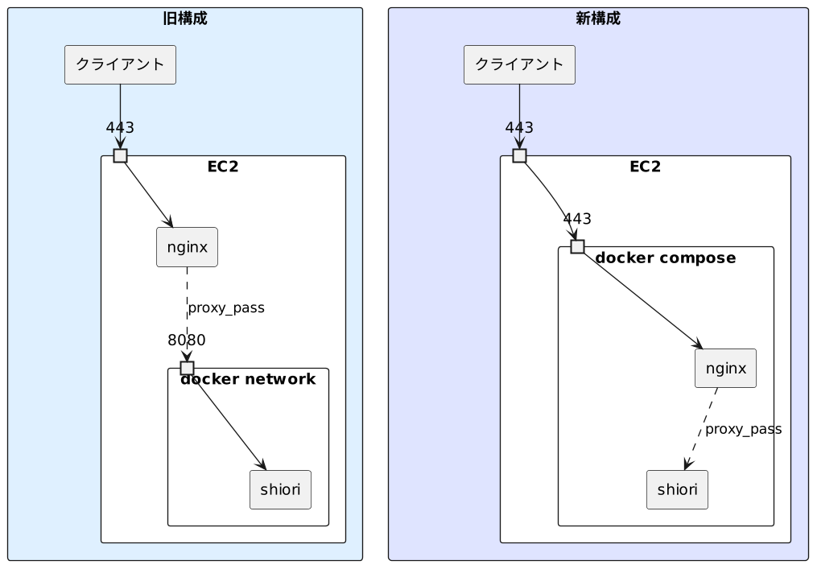

## 概要

Amazon Linux 2 の EPEL 版 nginx を Docker の nginx に移行する。

併せて、Docker で稼働する他のアプリケーションコンテナも Docker Compose を利用して同一ネットワークにて管理する。

## 環境

| 項目                   | バージョン / 種類                      |
| ---------------------- | -------------------------------------- |
| EC2 インスタンスタイプ | t4g.nano                               |
| OS                     | Amazon Linux release 2 (Karoo)         |
| nginx (EPEL)           | nginx version: nginx/1.12.2            |
| nginx (docker)         | nginx:1.23.3                           |
| Docker                 | Docker version 20.10.13, build a224086 |
| Docker Compose         | Docker Compose version v2.14.2         |

## 詳細

Amazon EC2 上に リバースプロキシとして振る舞う nginx の Web サーバがあり、これを通じて[Docker 版の Shiori](https://github.com/go-shiori/shiori/pkgs/container/shiori)を利用できるようにしている。



上図左の通り、移行前の構成ではパッケージ版の nginx が外部からリクエストを受ける。

この nginx から`proxy_pass`により、内部で稼働するアプリケーションコンテナ(`shiori`)へ転送している。

移行後の構成としては上図右のように、ホスト側の`443`番ポートを Docker Compose のネットワーク内で稼働する nginx へ接続し、ここで外部からのリクエストを受ける。

この nginx から`proxy_pass`により、同じネットワーク内にあるアプリケーションコンテナへ転送する。

外部とは Let's Encrypt の証明書を利用した HTTPS 接続を行う。

Certbot はひとまず現行と同じく EPEL リポジトリのものを利用する。

## 各種設定ファイル

ファイルの配置は以下の通りとする

```plaintext
├── docker-compose.yaml
├── nginx
│   └── conf.d
│       └── shiori.example.com
└── shiori
    ├── archive
    ├── shiori.db
    └── thumb
```

### `docker-compose.yaml`

```yml
version: "3"

services:
  nginx:
    image: nginx:1.23.3
    container_name: nginx
    volumes:
      - /etc/letsencrypt:/etc/letsencrypt:ro
      - /var/www:/var/www:ro
      - ./nginx/conf.d:/etc/nginx/conf.d:ro
    ports:
      - 80:80
      - 443:443
    restart: always

  shiori:
    image: ghcr.io/go-shiori/shiori:v1.5.3-35-g27c2fc7
    container_name: shiori
    volumes:
      - "${HOME}/shiori:/shiori"
    environment:
      - PUID=1000
      - PGID=1000
    restart: always
```

`/etc/letsencrypt`は Let's Encrypt の証明書関連のファイルを参照するためにマウントする。

`/var/www`は`certbot`による証明書更新の際、`.well-known`を`nginx`から外部に公開するためにマウントする。

この更新のために、`80`番ポートもバインドする。

`/nginx/conf.d`には後述する設定ファイルを配置する。

`shiori`の部分については、もともと下記のようなスクリプトで稼働していたものから移行した。

```bash
docker run --rm -d /
  --restart=always \
  --name shiori \
  -v "$(pwd)/shiori:/shiori" \
  -u "$(id -u):$(id -g)" \
  -p 8080:8080 \
  shiori:v1.5.3-35-g27c2fc7
```

`nginx`が同一ネットワークになるため、`shiori`の`8080`番ポートは外部に公開(`publish`)はしない。

### nginx の設定ファイル

nginx の設定ファイルは以下の通り`https://shiori.example.com`でアクセスできる設定とする。

```nginx
server {
        listen 80;
        server_name shiori.example.com;

        location ^~ /.well-known {
                alias           /var/www/.well-known;
        }

        location / {
                return 301 https://$host$request_uri;
        }
}

server {
        server_name shiori.example.com;
        listen 443 http2 ssl;
        <!-- 各種設定 -->

        ssl_certificate         /etc/letsencrypt/live/shiori.example.com/fullchain.pem;
        ssl_certificate_key     /etc/letsencrypt/live/shiori.example.com/privkey.pem;

        location / {
                proxy_pass      http://shiori:8080/;
                proxy_set_header HOST $host;
                proxy_set_header X-Forwarded-Host $host;
                proxy_set_header X-Real-IP $remote_addr;
                proxy_set_header X-Forwarded-For $proxy_add_x_forwarded_for;

                <!-- 各種設定 -->
        }
}
```

### Certbot

Certbot による証明書の自動更新を`certbot-renew.timer`にて行っていたため、Hook の設定も下記の通り変更する。

```bash
sudoedit /etc/letsencrypt/renewal-hooks/post/reload-nginx.sh
```

```diff
  #!/bin/bash

- systemctl reload nginx
+ docker exec nginx nginx -s reload
```

## 動作確認

```bash
# 既存のWebサーバの停止
sudo systemctl stop nginx

# 既存のアプリケーションコンテナの停止
docker stop shiori

docker compose up -d

# 証明書の更新、Hookの確認
sudo certbot --dry-run renew
```
