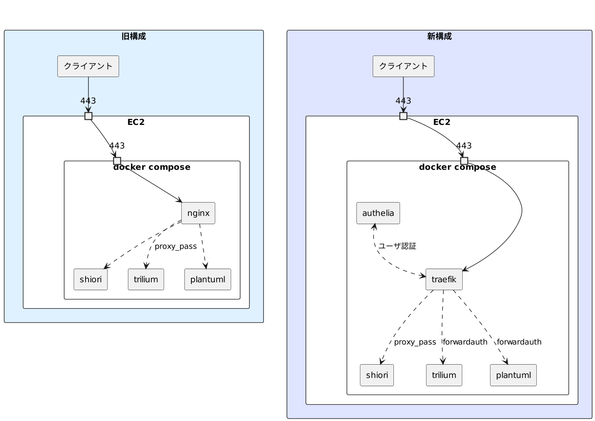

## 概要

自分用に複数のアプリケーションを稼働させているサーバにおいて、以下に対応するため構成を変更することにした。

1. 今後は [SiYuan](https://github.com/siyuan-note/siyuan) のようなログイン機能を持たないアプリケーションも自分用に安全に公開したい。
1. PlantUML は [VSCode の拡張機能](https://marketplace.visualstudio.com/items?itemName=jebbs.plantuml)からも利用できるようにベーシック認証を設定したい。
1. 現状は Shiori, Trilium Notes などそれぞれで別アカウントでのログインが必要なので、シングルサインオン(SSO)に対応したい。
1. SSL/TLS 証明書は`certbot-renew.timer`を利用して各サブドメインごとに更新していたが、`*.example.com` のようなワイルドカード証明書を取得したい。
1. HTTP3 を使ってみたい。

## 方針

以下の理由から、ルーティングは既存の nginx から Traefik へ変更することにした。

- 既存環境が Docker Compose 上に構築されていること。
- [dnsChallenge](https://doc.traefik.io/traefik/https/acme/#dnschallenge) の指定で DNS-01 チャレンジ によるワイルドカード証明書取得ができること。
- [fowardauth](https://doc.traefik.io/traefik/middlewares/http/forwardauth/) によりユーザ認証を挟めること。
- 試験的ではあるが HTTP3 を有効にできること。 (nginx では自分でビルドが必要)

ユーザ認証には Keycloak も検討したが、当該インスタンスのディスク容量が少ないことから、よりサイズの小さい Authelia を採用した。

メモリ使用量については比較ができなかったが、Go の方が少ないだろうという思い込みもある。

| 項目                  | Authelia     | Keycloak     |
| --------------------- | ------------ | ------------ |
| Docker イメージサイズ | 小 (約 55MB) | 大(約 450MB) |
| 実装言語              | Go           | Java         |

構成の概要図は以下の通り。



各アプリケーションの認証方式は以下のようになる。

| アプリケーション | 旧構成   | 新構成               |
| ---------------- | -------- | -------------------- |
| Shiori           | 独自認証 | 独自認証             |
| Trilium Notes    | 独自認証 | パスワード認証 (SSO) |
| PlantUML         | 認証なし | ベーシック認証 (SSO) |

また、Authelia 自身のログインには Web Authn による二段階認証を設定する。

## Traefik の設定

`traefik.yml` は以下の通りとした。

検証の際は `caServer: https://acme-staging-v02.api.letsencrypt.org/directory` を有効にする。

<details>
<summary>traefik.yml</summary>

```yml
global:
  checknewversion: true
  sendanonymoususage: false

experimental:
  http3: true

entryPoints:
  web:
    address: :80
    # httpsにリダイレクト
    http:
      redirections:
        entrypoint:
          to: webSecure
          scheme: https
  webSecure:
    address: :443
    http:
      tls: true
    http3: {}

api:
  insecure: false
  dashboard: true

providers:
  file:
    directory: /etc/traefik/
  docker:
    exposedByDefault: false

certificatesResolvers:
  myresolver:
    acme:
      email: hoge@example.com
      storage: /letsencrypt/acme.json
      # caServer: https://acme-staging-v02.api.letsencrypt.org/directory
      dnsChallenge:
        provider: gandiv5
        resolvers:
          - "ns-a.example.com:53"
          - "ns-b.example.com:53"
          - "ns-c.example.com:53"
      keyType: EC384
```

</details>

`compose.yaml`のコンテナ設定は以下。

Gandi でドメインを取得しているため、ワイルドカード証明書取得のために `GANDIV5_API_KEY` を環境変数として渡す。

ミドルウェアとして指定されている `auth@docker` は後述の Authelia のコンテナを指している。

<details>
<summary>compose.yaml</summary>

```yml
services:
  traefik:
    image: "traefik:v2.9"
    container_name: traefik
    ports:
      - "80:80"
      - "443:443"
    environment:
      GANDIV5_API_KEY: "${GANDIV5_API_KEY}"
    labels:
      traefik.enable: true
      traefik.http.routers.api.service: api@internal
      traefik.http.routers.api.rule: Host(`traefik.example.com`) && PathPrefix(`/api`)
      traefik.http.routers.api.entrypoints: webSecure
      traefik.http.routers.api.tls.certresolver: myresolver
      traefik.http.routers.api.middlewares: auth@docker

      traefik.http.routers.dashboard.service: dashboard@internal
      traefik.http.routers.dashboard.rule: Host(`traefik.example.com`) && PathPrefix(`/dashboard`)
      traefik.http.routers.dashboard.entrypoints: webSecure
      traefik.http.routers.dashboard.tls.certresolver: myresolver
      traefik.http.routers.dashboard.middlewares: strip-auth
      traefik.http.middlewares.strip-auth.chain.middlewares: auth@docker,dashboard-stripprefix
      traefik.http.middlewares.dashboard-stripprefix.stripprefix.prefixes: /dashboard

      traefik.http.routers.wildcard-certs.tls.certresolver: myresolver
      traefik.http.routers.wildcard-certs.tls.domains[0].main: example.com
      traefik.http.routers.wildcard-certs.tls.domains[0].sans: "*.example.com"
    volumes:
      - /var/run/docker.sock:/var/run/docker.sock:ro
      # rootless-docker
      # - //run/user/1000/docker.sock:/var/run/docker.sock:ro
      - ${PWD}/traefik/:/etc/traefik/:ro
      - ${PWD}/letsencrypt/:/letsencrypt/
    restart: unless-stopped
```

</details>

## Authelia の設定

鍵の値など秘密情報があるが、それらのパラメータは環境変数ではなく `secrets` に指定して渡す。

コンテナ側の `secrets` で利用するものを指定した上で、`/run/secrets/` 内のファイル名にアクセスすると、ファイルの内容が展開されて参照することができる。

> A secret value can be loaded by Authelia when the configuration key ends with one of the following words: key, secret, password, or token.

[Secrets - Configuration - Authelia - (www.authelia.com)](https://www.authelia.com/configuration/methods/secrets/)

`compose.yaml` の `secrets` 部分の記述は以下。

```yml
secrets:
  authelia_jwt_secret_file:
    file: "${PWD}/secrets/authelia/jwt_secret.txt"
  authelia_session_secret_file:
    file: "${PWD}/secrets/authelia/session.secret.txt"
  authelia_storage_encryption_key_file:
    file: "${PWD}/secrets/authelia/storate.encryption_key.txt"
```

`compose.yaml` のコンテナの設定は以下。

<details>
<summary>compose.yaml</summary>

```yml
auth:
  container_name: auth
  image: authelia/authelia:4.37
  restart: unless-stopped
  command: ["--config", "/config/configuration.yml"]
  volumes:
    - ${PWD}/authelia-data/config/:/config/
  environment:
    TZ: "Asia/Tokyo"
    AUTHELIA_JWT_SECRET_FILE: "/run/secrets/authelia_jwt_secret_file"
    AUTHELIA_SESSION_SECRET_FILE: "/run/secrets/authelia_session_secret_file"
    AUTHELIA_STORAGE_ENCRYPTION_KEY_FILE: "/run/secrets/authelia_storage_encryption_key_file"
  labels:
    traefik.enable: true
    traefik.http.routers.auth.rule: Host(`auth.example.com`)
    traefik.http.routers.auth.entryPoints: webSecure
    traefik.http.routers.auth.tls.certresolver: myresolver

    traefik.http.middlewares.auth.forwardAuth.address: http://auth:9091/api/verify?rd=https%3A%2F%2Fauth.example.com%2F
    traefik.http.middlewares.auth.forwardAuth.trustForwardHeader: true
    traefik.http.middlewares.auth.forwardAuth.authResponseHeaders: Remote-User,Remote-Groups,Remote-Name,Remote-Email
    traefik.http.middlewares.auth-basic.forwardAuth.address: http://auth:9091/api/verify?auth=basic
    traefik.http.middlewares.auth-basic.forwardAuth.trustForwardHeader: true
    traefik.http.middlewares.auth-basic.forwardAuth.authResponseHeaders: Remote-User,Remote-Groups,Remote-Name,Remote-Email
  deploy:
    resources:
      limits:
        cpus: "1.0"
        memory: 250M
  secrets:
    - authelia_jwt_secret_file
    - authelia_session_secret_file
    - authelia_storage_encryption_key_file
```

</details>

`traefik.http.middlewares.auth-basic` はベーシック認証のミドルウェア、
`traefik.http.middlewares.auth` はパスワード認証のミドルウェアとなる。

`argon2` による認証の場合、ログイン時に負荷が高まるためリソース制限したほうが安定した。

`configuration.yml` は以下。

<details>
<summary>configuration.yml</summary>

```yml
theme: light
# AUTHELIA_JWT_SECRET_FILE
# jwt_secret: ****
default_2fa_method: webauthn
server:
  host: 0.0.0.0
  port: 9091
  path: ""
  enable_pprof: false
  enable_expvars: false
  disable_healthcheck: false
  headers:
    csp_template: ""
    # csp_template: "default-src 'self'; frame-src 'none'; object-src 'none'; style-src 'self' 'unsafe-inline' 'nonce-********'; frame-ancestors 'none'; base-uri 'self'"

authentication_backend:
  file:
    path: /config/users.yml
    watch: false
    search:
      email: false
      case_insensitive: false
    password:
      algorithm: argon2
      argon2:
        variant: argon2id
        iterations: 3
        memory: 65536
        parallelism: 4
        key_length: 32
        salt_length: 16

webauthn:
  disable: false
  display_name: "Hoge Auth"
  attestation_conveyance_preference: indirect
  user_verification: preferred
  timeout: 60s

session:
  name: authelia_session
  domain: example.com
  same_site: strict
  # AUTHELIA_SESSION_SECRET_FILE
  # secret: ****
  expiration: 7d
  inactivity: 12h
  remember_me_duration: 1M

access_control:
  default_policy: deny
  rules:
    - domain: "auth.example.com"
      policy: two_factor
    - domain: ["traefik.example.com", "trilium.example.com"]
      policy: one_factor
      subject:
        - "group:admin"
    - domain: "plantuml.example.com"
      policy: one_factor
      subject:
        - "group:admin"
        - "group:guest"

storage:
  local:
    path: /config/db.sqlite3
  # AUTHELIA_STORAGE_ENCRYPTION_KEY_FILE
  # encryption_key: ****

notifier:
  filesystem:
    filename: /config/notification.txt
```

</details>

`argon2` のパラメータについては　[RFC 9106](https://www.rfc-editor.org/rfc/rfc9106.html) の以下を参考に設定した。

> If much less memory is available, a uniformly safe option is Argon2id with t=3 iterations, p=4 lanes, m=2^(16) (64 MiB of RAM), 128-bit salt, and 256-bit tag size. This is the SECOND RECOMMENDED option.

VSCode での PlantUML 利用時、ベーシック認証情報を平文で書く必要があるため、PlantUML 用のゲストユーザ (`group:guest`) を作成し `plantuml.example.com` のみ許可するようにした。

## 各アプリケーションの設定

それぞれ利用する認証方式にあったミドルウェアを指定した。

<details>
<summary>compose.yaml</summary>

```yml
shiori:
  image: ghcr.io/go-shiori/shiori:v1.5.4-6-g888e59d
  container_name: shiori
  volumes:
    - "${PWD}/shiori:/shiori"
  labels:
    traefik.enable: true
    traefik.http.routers.shiori.rule: Host(`shiori.example.com`)
    traefik.http.routers.shiori.entrypoints: webSecure
    traefik.http.routers.shiori.tls.certresolver: myresolver
  environment:
    - PUID=1000
    - PGID=1000
  restart: unless-stopped

plantuml:
  image: plantuml/plantuml-server:jetty-v1.2023.1
  container_name: plantuml
  command: --module=http-forwarded
  labels:
    traefik.enable: true
    traefik.http.routers.plantuml.rule: Host(`plantuml.example.com`)
    traefik.http.routers.plantuml.entrypoints: webSecure
    traefik.http.routers.plantuml.tls.certresolver: myresolver
    traefik.http.routers.plantuml.middlewares: auth-basic@docker
  restart: unless-stopped

trilium:
  image: zadam/trilium:0.59.3
  container_name: trilium
  volumes:
    - "${PWD}/trilium-data:/home/node/trilium-data"
  environment:
    - USER_UID=1000
    - USER_GID=1000
  labels:
    traefik.enable: true
    traefik.http.routers.trilium.rule: Host(`trilium.example.com`)
    traefik.http.routers.trilium.entrypoints: webSecure
    traefik.http.routers.trilium.tls.certresolver: myresolver
    traefik.http.routers.trilium.middlewares: auth@docker
  restart: unless-stopped
```

</details>

### 独自ログイン機能の無効化

Shiori はログイン機能を無効にできなかったため、Authelia による認証をバイパスする。

Trilium Notes は [Disable authentication](https://github.com/zadam/trilium/wiki/Server-installation#disable-authentication) の通り `config.ini` で以下設定を行うと可能だった。

```ini
[General]
noAuthentication=true
```

## 不要設定を解除

従来利用していた SSL/TLS 証明書の自動更新を無効化する。

```bash
sudo systemctl disable certbot-renew.timer
# > Removed symlink /etc/systemd/system/timers.target.wants/certbot-renew.timer.
```

## 使用感

それ自身が重いため、移行前から PlantUML の利用は安定しなかったが、それ以外については t4g.micro のインスタンス( RAM 512 MB, スワップ 1GB) でも使用感に問題はなかった。
